# Website Documentation

## 1. Create a New Page

### Step 1 — Create the folder

```
new-page/
└── index.html
```

### Step 2 — Use this HTML template

```
<!doctype html>
<html lang="en">

<head>
  <meta charset="utf-8" />
  <meta name="viewport" content="width=device-width, initial-scale=1"/>
  <meta name="theme-color" content="#080B0F"/>
  <meta name="author" content="Pedakolimi Harish" />
  <title>PAGE TITLE | Pedakolimi Harish</title>
  <meta name="description" content="PAGE DESCRIPTION"/>
  <link rel="canonical" href="https://pedakolimiharish.github.io/PAGE-PATH/"/>

  <!-- Shared CSS -->
  <link rel="stylesheet" href="/assets/css/site.css"/>

  <!-- Page-specific CSS, if required -->
  <link rel="stylesheet" href="/assets/css/PAGE-SPECIFIC.css"/>

  <!-- Shared JavaScript -->
  <script src="/assets/js/components.js" defer></script>

  <script src="/assets/js/site.js" defer ></script>

  <!-- Cloudflare Web Analytics --><script type='module' src='https://static.cloudflareinsights.com/beacon.min.js' data-cf-beacon='{"token": "ab73527048e649f48a72e31f3aa3d1ca"}'></script><!-- End Cloudflare Web Analytics -->

</head>

<body class="page page--PAGE-NAME">

  <a class="c-skip-link" href="#main-content" >
    Skip to content
  </a>

  <!-- Header -->
  <div id="site-header"></div>

  <!-- Main Content -->
  <main class="l-page-main" id="main-content">

    <!-- PAGE CONTENT -->

  </main>

  <!-- Footer -->
  <div id="site-footer"></div>

</body>

</html>
```

### Step 3 — Add your page content

Put the page content inside:

```
<main
  class="l-page-main"
  id="main-content"
>

  <!-- PAGE CONTENT -->

</main>
```

### Step 4 — Add page CSS only if needed

Use:

```
assets/css/
└── page-name.css
```

Do not modify `site.css` unless the styling is genuinely shared.

---

# 2. Create a New Experience / Project

### Step 1 — Create the project or Experience folder

```
assets/
└── experience_assets/
    └── project_name/
```

### Step 2 — Create the project HTML

```
assets/
└── experience_assets/
    └── project_name/
        └── project_name.html
```

### Step 3 — Copy an existing project or Experience template

Copy: 
for project Tamplate with all the features

```
assets/experience_assets/project_demo/project_demo.html
```

for Experience template 
```
assets/experience_assets/experience_demo/experience_demo.html
```

and rename it to your liking

```
project_name.html
```

### Step 4 — Change the project information

Change:

1 - This will be your project or experience name.

```
<article class="c-timeline-item" id="project-name">
```
2 - Here you will put the year or date.
```
<p class="c-timeline-item__year">
  2026 - 2020
</p>
```
3 - Here you will make badge like. 

|Label|When to use|
|---|---|
|**Personal Project**|You built it independently|
|**University Project**|Academic/university project|
|**Research Project**|Research-oriented work|
|**Team Project**|Built as part of a team|
|**Client Project**|Built for a client|
|**Industry Project**|Built for an industry/company context|
|**Open Source**|Public/open-source project|
|**Experimental**|Mainly experimentation/prototyping|
|**Fun Project**|Hobby/just-for-fun project|
|**Competition Project**|Built for a competition/hackathon|
|**Startup Project**|Built as part of a startup/business|
|**Academic Project**|General academic work|

you will use one of it here

```
<span class="c-badge c-badge--personal"> Personal Project </span>
```

4 - Same here above above

|Label|Meaning|
|---|---|
|**Concept Stage**|Idea/architecture stage|
|**Research Stage**|Research and investigation|
|**Prototype**|Initial working prototype|
|**Development**|Actively being developed|
|**Testing**|Testing/validation phase|
|**In Progress**|Work is actively continuing|
|**Completed**|Finished|
|**On Hold**|Temporarily stopped|
|**Archived**|No longer actively maintained|
|**Production**|Deployed/used in a real environment|
|**Maintenance**|Completed but still maintained|

you will use one of it here or you can just comment it out too
```
<span class="c-badge c-badge--concept"> Concept Stage </span>
```
5 - This is again project or exp name but this one will show up in website
```
<h2 class="c-timeline-item__title">
  Project Name
</h2>
```

6 - This is small subtitle like very breaf explation
```
<p class="c-timeline-item__subtitle">
  Project Subtitle
</p>
```

7 - Here you can have short description or just put long one if you expericens do not have phots or video or link, you can use this one with multiple `<p>...</p>`
```
<div class="c-timeline-item__summary">
      <p>
        Short project description 1
      </p>

      <p>
        Short project description
      </p>
    </div>
```

### Step 5 — Add technology badges

Here we need to add which tectnology you used-
```
<ul
  class="c-tech-list"
  data-tech="ros2 cpp python"
  aria-label="Technologies used in Project Name"
></ul>
```

Use only technology keys registered in:

```
assets/js/tech-badges.js
```

we have these now

| Technology | Code Name | Preview |
|---|---|---|
| ROS 2 | `ros2` |  |
| C++ | `cpp` |  |
| Python | `python` |  |
| Arduino | `arduino` | 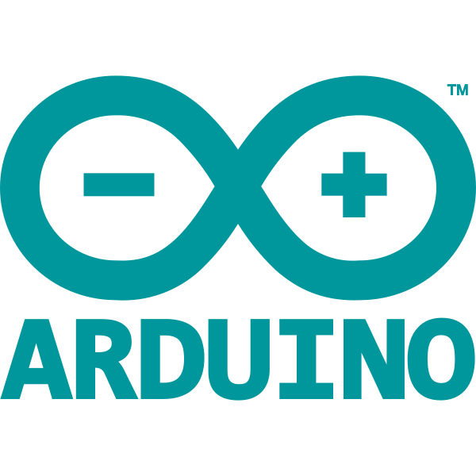 |
| STM32 | `stm32` |  |
| ESP32 | `esp32` |  |
| OpenCV | `opencv` |  |
| Gazebo | `gazebo` | 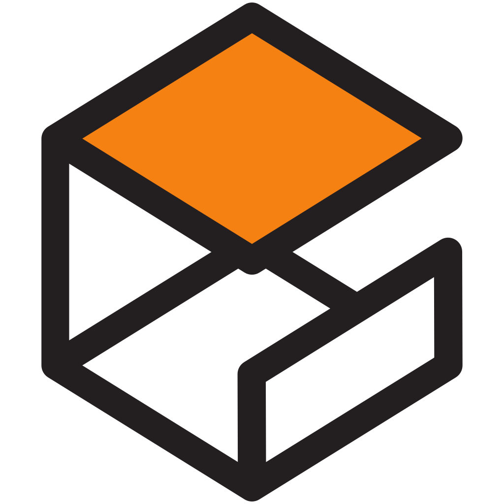 |
| MoveIt | `moveit` | 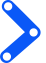 |
| Docker | `docker` | 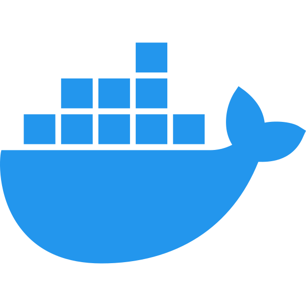 |
| Git | `git` |  |
| Linux | `linux` |  |
| Ubuntu | `ubuntu` | 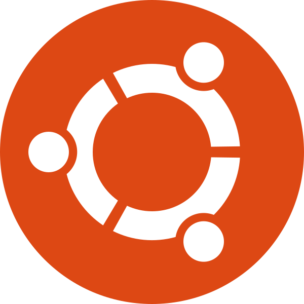 |
| Nav2 | `nav2` | 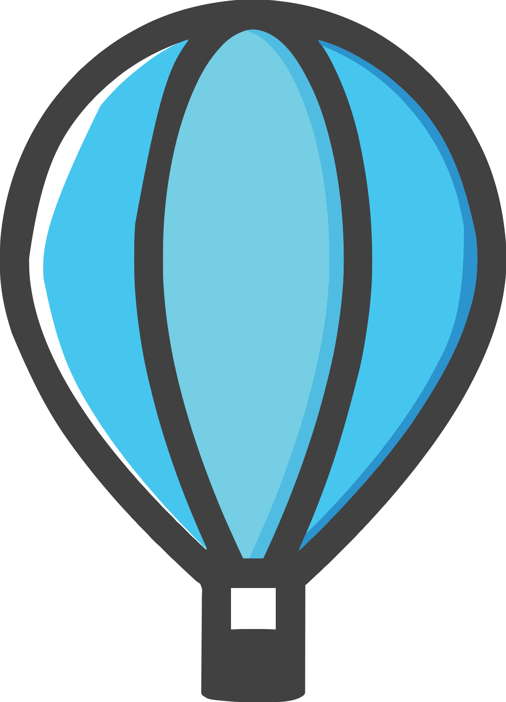 |
| PyTorch | `pytorch` | 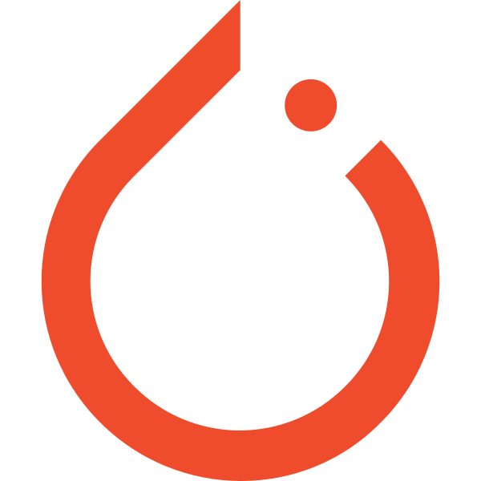 |
| Raspberry Pi | `raspberrypi` |  |
| AI | `ai` |  |
| YOLO | `yolo` |  |
| NumPy | `numpy` | 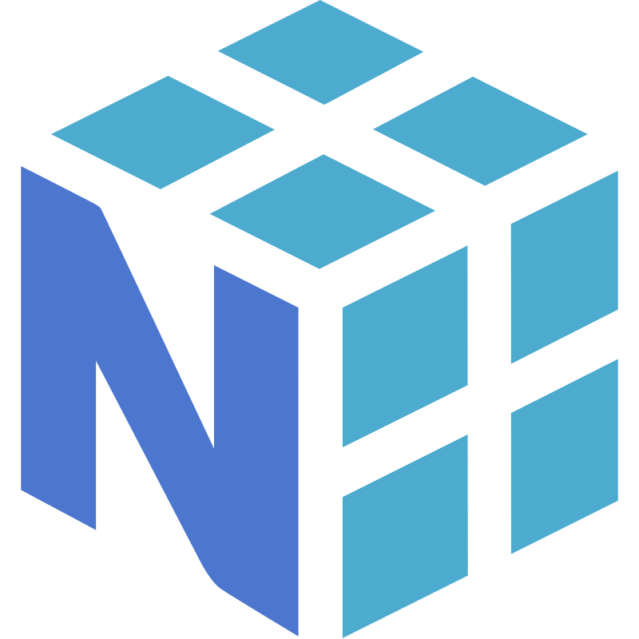 |
| Flask | `flask` | 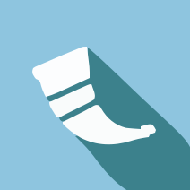 |
| SciPy | `scipy` | 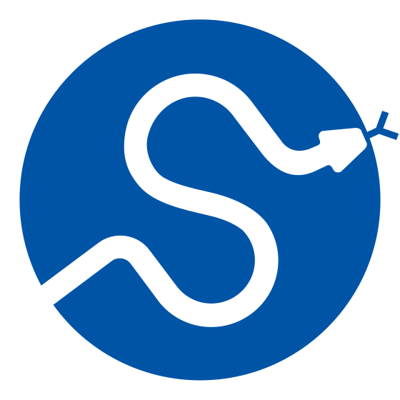 |
| Plotly | `plotly` | 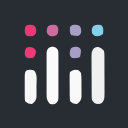 |
| JavaScript | `javascript` |  |
| HTML | `html` |  |
| 3D Printing | `printing3d` | 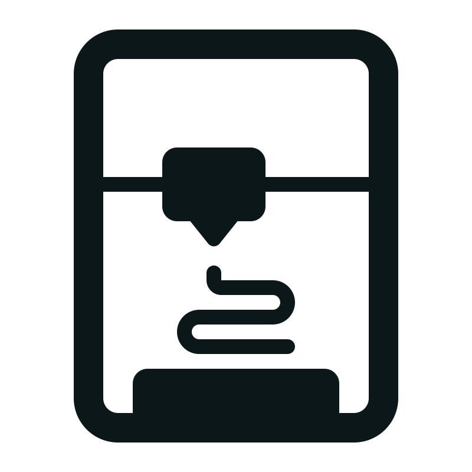 |
| CAD | `cad` |  |
| Duet3D | `duet3d` | 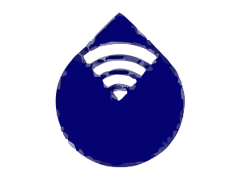 |

| LinkedIn |  |  |
| GitHub |  | 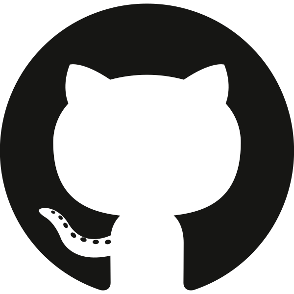 |
| Robot |  | 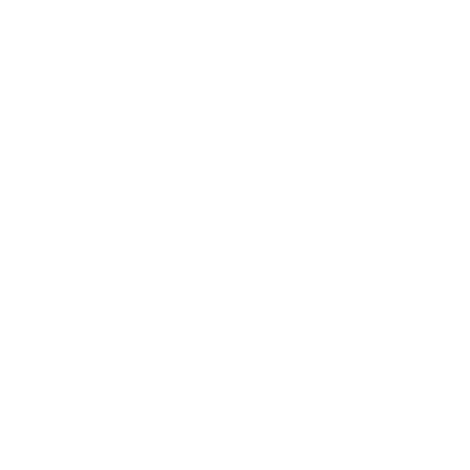 |

### Step 6 — Add Project Overview

Keep:

from  there we are in Read More conten if you do not have anything to put in this you can just comment it out from `<button class="c-read-more" type="button" data-expand-button aria-expanded="false"> ` to `<div class="c-expand-content"> .. </div> ` it is around 200 lines

if you have more thinsg to add, then do it below, ihave 2 cards, Project Overview, the gallery and video then at last we have links

Here inside `c-project-info__content` we will add project overview is paragrams of blueets points
```
<section class="c-experience-card c-experience-card--overview">

  <div class="c-card-header">

    <h3 class="c-card-title">
      Project Overview
    </h3>

  </div>

  <div class="c-project-info__content">

    <p>
      Project description.
    </p>

    <p>
      More project information.
    </p>

  </div>

</section>
```

### Step 7 — Add Gallery if required

Here we will put all the photos related to project or expecriences with caption


Put images directly inside the project folder 

```
project_name/
├── project_name.html
├── image1.jpg
├── image2.jpg
└── image3.jpg
```

Use:

```

```

If there are no images, remove the Gallery section.

### Step 8 — Add Videos if required

Here we will put all the videos related to project or expecriences with caption

Put videos directly inside the project folder:

```
project_name/
├── project_name.html
└── demo.mp4
```

Use:

Here we need to edit `data-caption=`, `src=` and `c-video-caption`
```
<div
  class="c-video-player"
  data-video-player
  data-caption="Caption 1"
>
  <video controls controlsList="nofullscreen nodownload" preload="metadata">
    <source
      src="/assets/experience_assets/project_demo/test1.mp4"
      type="video/mp4"
    />
  </video>

  <p class="c-video-caption">Caption 1</p>

  <button
    class="c-video-fullscreen"
    type="button"
    data-video-fullscreen
    aria-label="Enter fullscreen"
  >
    ⛶
  </button>
</div>
```

If there are no videos, remove the Videos section.

### Step 9 — Add Project Links if required

Keep the Project Links card only if the project has useful links.

If there are no links, remove the entire card.

### Step 10 — Add the project to `site.js`

Open:

```
assets/js/site.js
```

Find:

```
const experienceItems = [
  "/assets/experience_assets/project_demo/project_demo.html",
];
```

Add:

```
const experienceItems = [
  "/assets/experience_assets/project_ember/project_ember.html",
  "/assets/experience_assets/project_name/project_name.html",
];
```

### Step 11 — Do not create project CSS or JS

Do **not** create:

```
project_name.css
project_name.js
```

Projects use:

```
assets/css/experience-items.css
assets/js/site.js
```

---

# 3. Add a New SVG Technology Icon

### Step 1 — Add the SVG

Place it in:

```
assets/icons/
```

Example:

```
assets/icons/micro-ros.svg
```

### Step 2 — Register it in `tech-badges.js`

Open:

```
assets/js/tech-badges.js
```

Inside:

```
const TECH_BADGES = {
```

add:

```
microRos: {
  name: "micro-ROS",
  icon: "/assets/icons/micro-ros.svg",
  className: "c-tech-badge--micro-ros",
},
```

### Step 3 — Add badge styling

Open:

```
assets/css/tech-badges.css
```

Add:

```
.c-tech-badge--micro-ros {
  color: #ffffff;
  background: rgb(0 120 180 / 0.12);
  border-color: rgb(0 120 180 / 0.30);
}
```

Adjust the colours as required so the logo remains visible.

### Step 4 — Use it in a project

In the project HTML:

```
<ul
  class="c-tech-list"
  data-tech="ros2 microRos cpp python"
  aria-label="Technologies used in Project Name"
></ul>
```

The badge will automatically be generated.

---

# 4. Quick Workflow

## New Page

```
Create folder
    ↓
Create index.html
    ↓
Copy page template
    ↓
Add Header + Footer placeholders
    ↓
Add page content
    ↓
Add page CSS if required
```

## New Project

```
Create project folder
    ↓
Copy project_ember.html
    ↓
Rename HTML
    ↓
Change project information
    ↓
Add technology badges
    ↓
Add Overview
    ↓
Add Gallery if needed
    ↓
Add Videos if needed
    ↓
Add Links if needed
    ↓
Add project path to site.js
    ↓
Test
```

## New SVG

```
Create SVG
    ↓
Place in assets/icons/
    ↓
Register in tech-badges.js
    ↓
Add CSS class in tech-badges.css
    ↓
Add key to data-tech
    ↓
Test
```